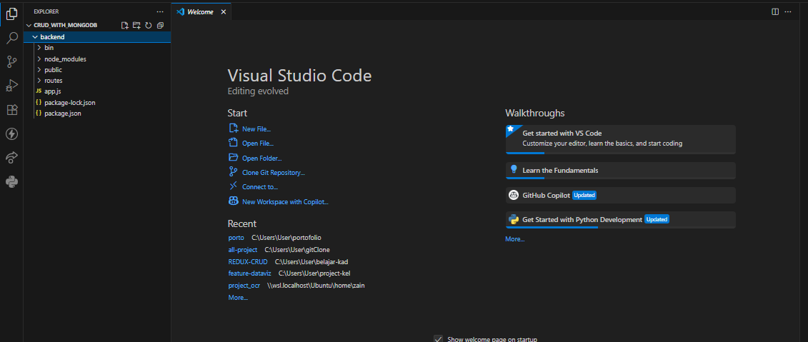

# Build a Backend CRUD with MONGODB and Node js

### 1.  SETUP
the first thing is installing the express using this command
```cmd
npm install -g express-generator
```
and then we make a folder without engine view using express
```cmd
express backend (name folder) --no-view
```
go to the BACKEND folder (use "cd backend") and then
```cmd
npm install
```
so this is the structure after we doing npm install




