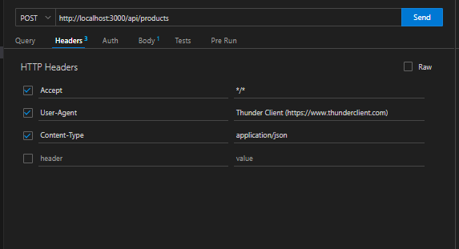
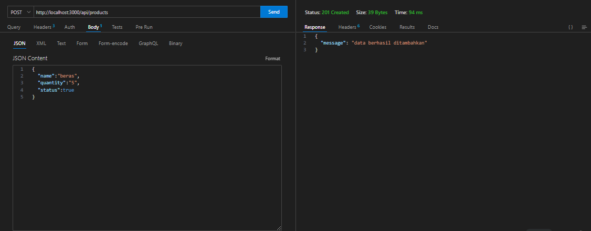
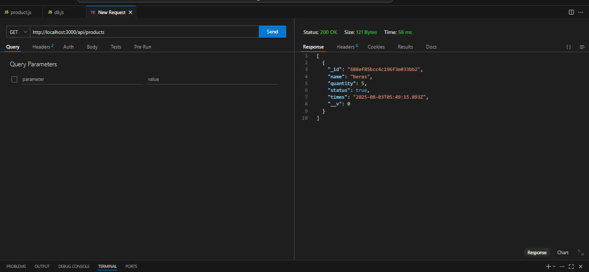
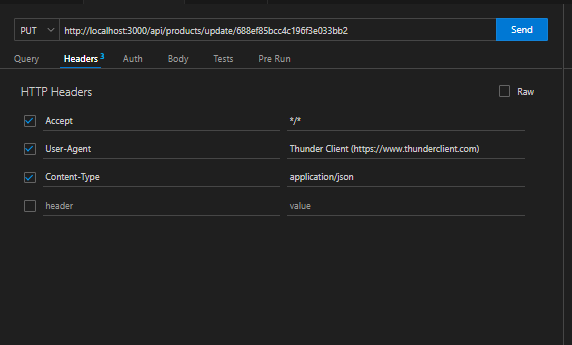
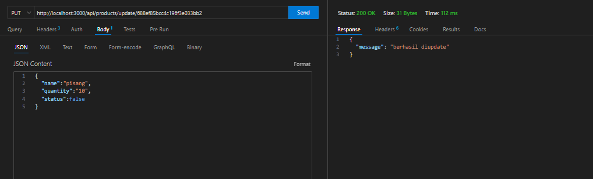
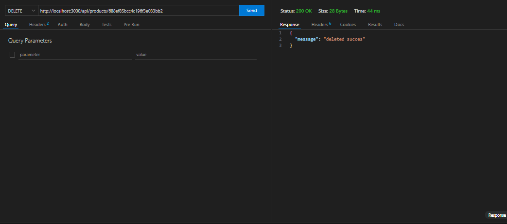

# Build a Backend CRUD with MONGODB and Node js

### 1.  SETUP
the first thing is installing the express using this command
```cmd
npm install -g express-generator
```
and then we make a folder without engine view using express
```cmd
express backend (name folder) --no-view
```
go to the BACKEND folder (use "cd backend") and then
```cmd
npm install
```
so this is the structure after we doing npm install


##### insttalling mongoose
mongoose is a DOM library that we can use to organize database in mongodb
```cmd
npm install mongoose
```

#### build the mongodb database
in backend proejct folder, you can make a new folder named "models" for example and then write this
```js
// import the mongoose
const mongoose = require('mongoose')

// using Schema, we werite this
const {Schema} = mongoose

// set the structure and data type
const crudSchema = new Schema({
    //name
    name:{
        type:String,
        required:true
    },
    quantity:{
        type:Number,
        required:true
    },
    times:{
        type:Date,
        //otomatis generate Date
        default: Date.now
    },
    status:{
        type:Boolean,
        required:true
    }
})

//export the model from the schema
module.exports = mongoose.model('Product',crudSchema)
```

- Schemas is like we define the rule and structured  database we used, you can set the data type, required filed, unique filed, populate, default, etc
- after we make schemas, we export the model of schemas so we can interact with database, the parameter in this command are named the model (Uppercase and singular) so in mongodb automatically convert to lowercase and plural (with 's')

#### BUILD THE CRUD ROUTE FOR HANDLE the request
1. make post route handler

in the project folder, you can got to routes folder and make a file product.js, before we make the route we should make util folder for handle the error in the route so the route code will clean and we not repeating writing try and catch to handle the error
in /backend/utils/AsyncHandler.js, write this
```js

const AsyncHandler = (functionRoute) => {
    return async function(req,res,next){
        try {
            await functionRoute(req,res)
            
        } catch (error) {
            //go to middleware error
            next(error)
            
        }
    }
}

module.exports = AsyncHandler;
```
- Searching data in database is asyncrhonus process because we need time to get the data in the outside of project so the asynchronus prevent the code still working while we wait the data result from database
- functioun route is functiou route handler in routes that we use
- theres is next parameter, the function is to passing the error to the middlweare error function. so middleware function is function that to check the req before route handle. Excepet for error middleware function, we can placed to the last after all route handler.

back to backend/product.js, the first step we want to make route handler for post method (post method used for submitting data from user/frontend), we handle it using post method

```js
// import asynchandler
const AsyncHandler = require('../utils/AsyncHandler')
//import express
const express = require('express')
//import route from router
const route = express.Router()

// import model
const Products = require('../models/Crud-models')
//handle submiting data
route.post('/',AsyncHandler(async(req,res) => {
    // get value in the req.body keyname in the request object
    const {name,quantity,status} = req.body

    // atau bisa ditulis
    // const name = req.body.name, etc

    // check apakah kosong atau tidak
    if(!name || !quantity || !status){
        return res.status(400).json({message:'Data tidak boleh kosong'}) // di handle di res.ok
    }
    //jika quantitiy data typenya bukan number, convert dulu ke Number krn dr req.body itu string
    //jika ISNan tru which is bentuk string datanya karena NAN not as number maka error
    if (isNaN(Number(quantity))){
        return res.status(400).json({message:"data type tidak benar"})
    }

    // masukan data ke database, convert quantity
    const addData = new Products({name,quantity:Number(quantity),status})
    await addData.save()

    //atai bisa ditulis
    // await Product.create({name,quantity,status})

    //ngirim response
    return res.status(201).json({message:'data berhasil ditambahkan'})

}))

module.exports = route
```
- so rule of naming the endpoint because in the app.js the route endpoint base is collection so in the route handler we just write '/' because we submitting data into the collection so we just write the endpoint '/'. and also the rule is using lowercase and not using action phrasses
- 400 status for bad reques for example like the input is false, data type, etc and 201 status when data succesfully submitting
- and we handle the error using if else and then we accesing the user input in the body, request is Object {} that have various key like method, body, and header, we can add for free the keyname in the request body
- isNan for checking if the variabel is not nmber become true if data is string become false if data is number
- convert first the quantitiy in the database
- 

in App.js we can write this
```js
//import route handler
const productRouter = require('./routes/product');
const express = require('express');
const app = express();
// import mongoDb connected
const connectDB = require('./config/db');

connectDB();

//parsing json from frontend
app.use(express.json());

//route product
app.use('/api/products',productRouter);

//middleware  error

app.use((err,re,res,next) => {
    console.log(err.stack())
})


module.exports = app;

```
- express.json used for parsing json data so we can use in req.body
- in the last there'is middleware error that have four parameter
- we can werite for global endpoint product like this '/api/products' we use plural and lowercase because it define collection
- we connected first to database mongo db by making function asynchroonus, we use mongoose to connected it
in ./config/db write this
```js
//import mongoose
const mongoose = require('mongoose');

//buat async fungsi untu konnect db
//yang butuh proses di luar kode itu harus menggunakan asynchronus ya
const connectDB = async() => {
    try {
        const connect = await mongoose.connect('mongodb://localhost:27017/product_db')
        console.log('MongoDb conneted')
    } catch (error) {
        console.log(error)
        
    }
}

module.exports = connectDB

```
- the database name is product_db and the url always have mongodb://localhost:27017/namedatabase

after we erite in app.js, we can test the API endpoint
- install thunderclient extension in vs code
- fill the method POST and url and req.body with the header too (because we want send data using JSON data type), like this



and then in body write like this, send data to test the API, so if succesfull the respond will be like this


so if we have frontendt in the front we will like this
```js
async function (){
    try{
        const response = await fetch('http://localhost:3000/api/products',{
            method:'POST',
            headers:{
                'Content-type':'application/json'
            },
            body:JSON.stringify({
                name:"beras",
                quantity:"5",
                status:true
            })
        })
        const data = await response.json();
        if (!response.ok){
            throw new Error(data.message) //from json({message:"error")
        }
    }catch(e){
        console.log(error)
    }
}

```

2. Route handler untuk menampilkan semua data
add this code in productroute.js
```js
route.get('/',AsyncHandler(async(req,res) => {
    // menggunakan find
    const data = await Products.find();
    //send to the user
    return res.status(200).json(data)
}))

```
when we want show all data we use mongodb find and status 200 for succes if we use get method, update, and delete method. After we write this we test this route using thunder client extension in vs code



as we can see if we use mongodb for databse will auto generate id when we sumbit the data using POST

3. Route handler for delete
```js
//route handler for update we use put method
route.put('/update/:id',AsyncHandler(async(req,res) => {
    //get params in url above
    const {id} = req.params
    if(!id){
        return res.status(400).json({message:"not found"})
    };
    //get data we want update from body
    const {name,quantity,status} = req.body
    // sttaus bollean biar false value tetep kebaca
    if(!name || !quantity || status == undefined){
        return res.status(400).json({message:"data cant empty"})
    };

    //find in database
    //if found return object if not return null
    const searchData = await Products.findOne({_id:id});
    //if not found
    if(!searchData){
        return res.status(404).json({message:'not found'})
    };

    //update
    searchData.name = name;
    searchData.quantity = quantity;
    searchData.status = status;

    //jangan lupa di save

    await searchData.save()

    return res.status(200).json({message:'berhasil diupdate'})
}))
   
   
}))

module.exports = route
```

- params used for get id data and update and showing detailed page, so we accesing the key in params object should match with inside the route handler
- we use findOne to search the data using  _id
- dont forget to save the data
- 404 status used for not found result

after we write this so we test using thunder client
- copy paste id in here :


- then set thunder client look like this



- set the body dan klik hasilya



4. Make Route handler for delete
add this route like this
```js
// route delete
route.delete('/:id',AsyncHandler(async(req,res) => {
    // accees params
    const {id} = req.params;
    if(!id){
        return res.status(400).json({message:'id empty'})
    }
    //find first
    const searchData = await Products.findOne({_id:id});
    if(!searchData){
        return res.status(404).json({message:'data not found'})
    }
    // delete using deleteOne
    await Products.deleteOne({_id:id});
    // return status
    return res.status(200).json({message:"deleted succes"});

}))
```
first we use findOne and the after that we use deleteOne. we test in thunder client




