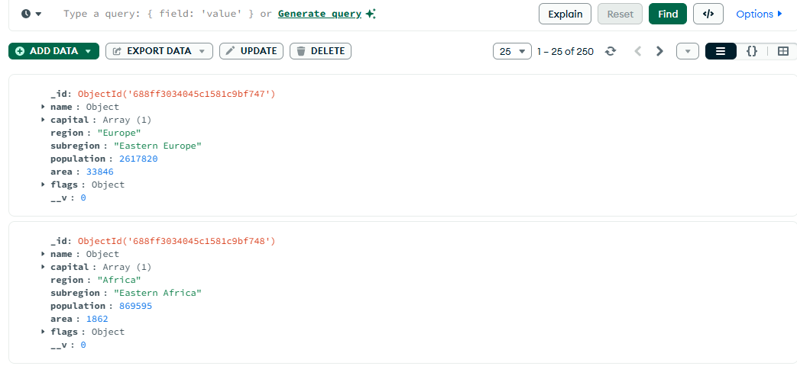
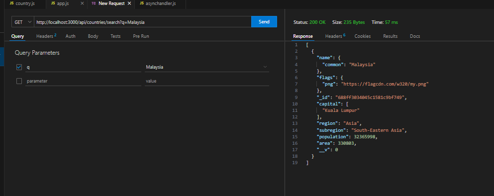
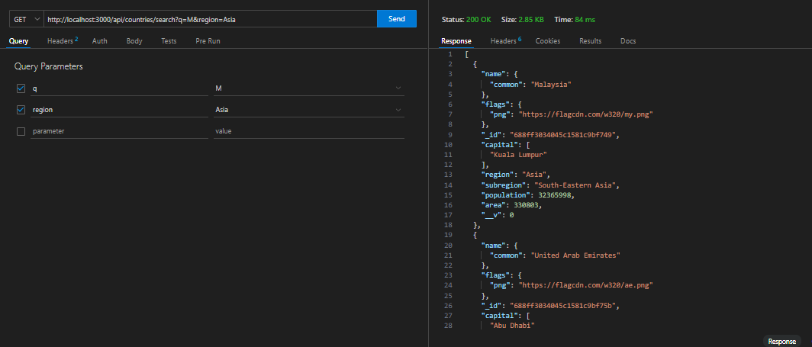
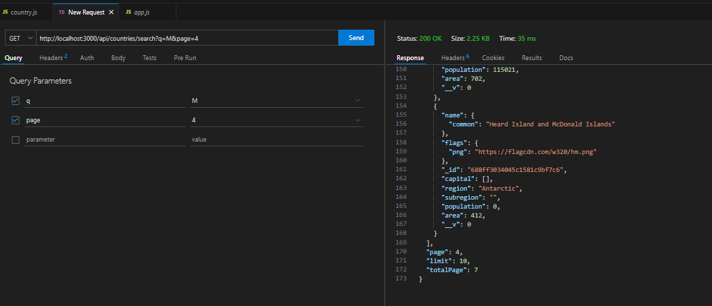

# Search and pagination
In this project we want implement searching and pagination, the first step is load data from API to mongoDB using mongoose, we need the sturcture so first we check the data
in folder data/fetch.js (you can make it in backend folder) dont forget install the express first

```js
// setipa proses dilar mneggunakan proses asynchronus ya 

async function getData(){
    try{
        const res = await fetch('https://restcountries.com/v3.1/all?fields=name,capital,region,subregion,population,area,flags')
        const data = await res.json()
        console.log(data)
    }catch(e){
        console.log(e)
    }
}

//call function
getData()
```
the structure of data like this
```json
 {
    flags: {
      png: 'https://flagcdn.com/w320/cv.png',
      svg: 'https://flagcdn.com/cv.svg',
      alt: 'The flag of Cape Verde is composed of five horizontal bands of blue, white, red, white and blue in the ratio of 6:1:1:1:3. A ring of ten five-pointed yellow stars is centered at three-eighth of the height from the bottom edge and three-eighth of the width from the hoist end of the field.'
    },
    name: {
      common: 'Cape Verde',
      official: 'Republic of Cabo Verde',
      nativeName: [Object]
    },
    capital: [ 'Praia' ],
    region: 'Africa',
    subregion: 'Western Africa',
    area: 4033,
    population: 555988
  },
  
```
so we make schema first based on data above
```js
const mongoose = require('mongoose')
//import schemas
const {Schema} = mongoose

//make schemas
const CountrySchemas = new Schema({
    name:{
        common:String
    },
    capital:[String],
    region:String,
    subregion:String,
    population:Number,
    area:Number,
    flags:{
        png:String
    }
})

//make model
module.exports =  new mongoose.model('Country',CountrySchemas);
```
 And then we add this data to Mongodb local using mongoose, because this is asyncrhonus process we use asynchronus function
 - run first
 ```cmd
 mongod
 ```
 - and then write in db/fetchandsave.js you can make own name
 ```js
 // import mongoose
const mongoose = require('mongoose')
// import schemas
const Countries = require('../models/Schemas')
// make asynchrnous function to save data to the local mongoDB

async function FetchSave() {

    try{
        await mongoose.connect('mongodb://localhost:27017/mydb') //connect to database`

        //fetch the data
        const response = await fetch('https://restcountries.com/v3.1/all?fields=name,capital,region,subregion,population,area,flags');
        //get json
        const data = await response.json()
        //insert to the model
        await Countries.insertMany(data);

        //close connection
        mongoose.connection.close()
        
    }catch(e){
        console.log(e)
    }
}

//call function
FetchSave()
 ```
 - run in cd backend/cd db/ node fetchandsave.js
 - 
 THE data will be like this


### Implement searching
in this task we can use query for handle searching taks in the backend
- make asynchandler and asynchronus function connect to mongodb
- make a route method get
```js
//import express
const express = require('express');
// router
const router = express.Router();
const asynchandler = require('../utils/asynchandler')
//schemas
const Countries = require('../models/Schemas')
//route
router.get('/search',asynchandler(async function(req,res) {
    // accesing query
    // query is object {}
    const query = req.query
    //check if none or not
    if(Object.keys(query).length == 0){
        return res.status(400).json({message:"empty query"})
    }
    //get all query in url
    const filter = {}
    Object.keys(query).forEach((item) => {
        if(item == 'q'){
            filter['q'] = req.query['q']
        }
    })

    //find in monogdb
    const searchData = await Countries.find({"name.common" : filter['q']}) //return list
    if(!searchData){
        return res.status(404).json({message:"not found"})
    }
    return res.status(200).json(searchData);
}))

module.exports = router
```
the query is object if we want search the item so we will produce the url
for example http://localhost:300/countries/search?:q=Indonesia, same as
```js
{"name.common" : filter['q']}
```
and when we seaching mongodb using find and include nested key we write in string mode not name.common (without string). when we search data jus main key we can use namekey type
```js
{
    q: Indonesa
}
```
the keyname in query based on url if url have more than 1 the url must be ?q=indonesua&region=Asia,
```js
{
    q:a,
    region:'Asia'
}

```
and next step we test this route using thunder client


### Implement search and filtering
we want search country thath have i (q in req.query) and filtering based region
```js
//import express
const express = require('express');
// router
const router = express.Router();
const asynchandler = require('../utils/asynchandler')
//schemas
const Countries = require('../models/Schemas');
//route
router.get('/search',asynchandler(async function(req,res) {
    //object query
    const query = req.query
    // make for filter
    const filter = {}
    
    //check key in query
    Object.keys(query).forEach((item) => {
        if(item == 'q'){
            filter['name.common'] = {$regex : query.q, $options: "i"} // add key in filer we want search by substing "if data has word ..." using regex and ignore case cesitive
        }else if(item == 'region'){
            filter['region'] = query.region
        }
    })

    // we can write this if field in mongodb same as key in filter
    const searchData = await Countries.find(filter)
    if(searchData.length == 0){
        return res.status(404).json({message:"data not found"})
    }
    return res.status(200).json(searchData)
}))

module.exports = router
```
- we use regex to search substring in data so when data has subtring in q we show it and options means we igonre case-sensitive word
and then we can test the route in thunder client



#### Add page and pagination
when we have many data its imposibble to us to show it all in one page so we need pagination. and we need to subset the data based page and limit that we want use for show the data

```js
//route
router.get('/search',asynchandler(async function(req,res) {
   // akses query
   const query = req.query;
   if(Object.values(query).length == 0){
    return res.status(400).json({message:'query tidak ditemukan'})
   }
   const filter = {}
   Object.keys(query).forEach((item) => {
    if(item == 'q'){
        filter['name.common'] = {$regex:query.q,$options:'i'}
    }
   })
   //pagintaion, if user pass the page query in url we use page or default 1 
   //separate page filtering and search filtering if we wannt use  await Countries.find(filter)
   //convert to number
   const page = parseInt(query['page']) || 1;
   //limit we define default 10
   const limit = 10
   //startpage ini berarti rumusnya (page-1) * limit page 1 dimulai  0  page 2 dimulai index 10
   const startItem = (page - 1) * limit
   //we subset the data using skip and limit
   //we use skip for start item
   const searchData = await Countries.find(filter)
        .skip(startItem) //subset data dimulai dari data ke -
        .limit(limit)
    if(searchData.length == 0){
        return res.status(404).json({message: "data tidak ditemukan"})
    } 
    //return hasilya
    return res.json({
        data:searchData,
        page,
        limit
    })

}))
```
- Pisahkan query url dengan query page biar bisa menggunakan shorcut await Countries.find(filter)
- konsep di topik ini adalah tentukan start item mulai data subset di index mana dengan (page-1) * limit kemudian menggunakan skip dan limit.

terus kalau mau mengirim totalPages hasil pencarian dan dikirm kan ke frontent buat navigasi di frontent maka bisa gunakan 
``` js
//import express
const express = require('express');
// router
const router = express.Router();
const asynchandler = require('../utils/asynchandler')
//schemas
const Countries = require('../models/Schemas');
//route
router.get('/search',asynchandler(async function(req,res) {
   // akses query
   const query = req.query;
   if(Object.values(query).length == 0){
    return res.status(400).json({message:'query tidak ditemukan'})
   }
   const filter = {}
   Object.keys(query).forEach((item) => {
    if(item == 'q'){
        filter['name.common'] = {$regex:query.q,$options:'i'}
    }
   })
   // hitung hasil pencarian semua menggunakan countDocument
   const totalData = await Countries.countDocuments(filter)
   
   //pagintaion, if user pass the page query in url we use page or default 1 
   //separate page filtering and search filtering if we wannt use  await Countries.find(filter)
   //convert to number
   const page = parseInt(query['page']) || 1;
   //limit we define default 10
   const limit = 10
   //startpage ini berarti rumusnya (page-1) * limit page 1 dimulai  0  page 2 dimulai index 10
   const startItem = (page - 1) * limit
   //we subset the data using skip and limit
   //we use skip for start item
   const searchData = await Countries.find(filter)
        .skip(startItem) //subset data dimulai dari data ke -
        .limit(limit)
    if(searchData.length == 0){
        return res.status(404).json({message: "data tidak ditemukan"})
    } 
    //return hasilya
    return res.json({
        data:searchData,
        page,
        limit,
        totalPage:Math.ceil(totalData/limit)
    })

}))

module.exports = router
```

- CounDocument used for counting all result from search data and we used this to determine total pages = total all result / limit, and then send to frontend for pagination

We test the bakend using thunder client

based on the result total pages for this result search data is 7 pages so we can try to change the page from 1 - 7 when we try to change the page 8, the data is not found

## Connected it to Frontend
